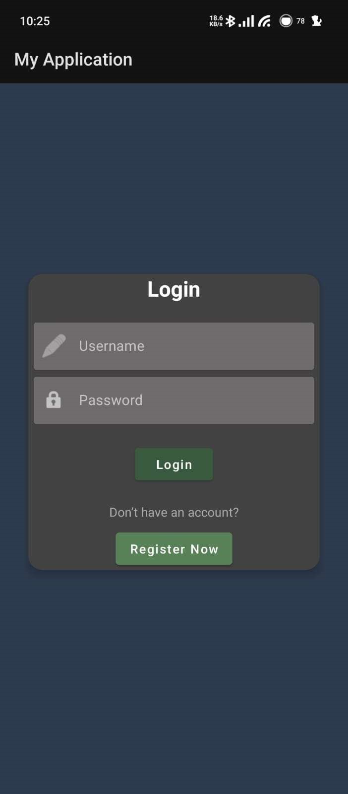
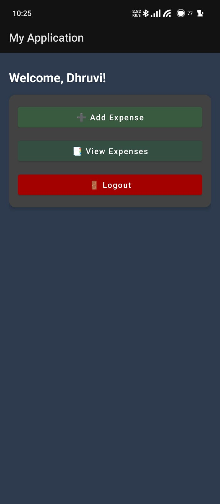
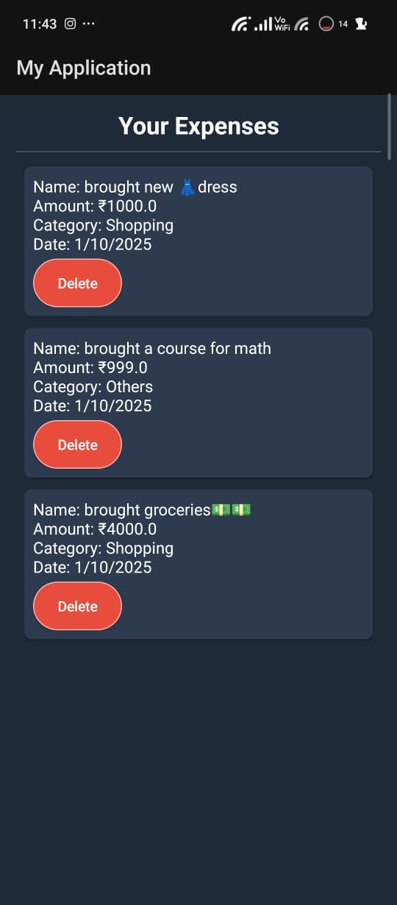

# 💰 Personal Expense Tracker App

A simple yet powerful Android application built using **Java** and **SQLite** that helps users manage their daily expenses efficiently.  
It includes secure **user registration**, **login**, and **CRUD (Create, Read, Update, Delete)** operations for expense management — all wrapped in a clean, modern UI.

---

## 📱 Features

✅ **User Authentication**
- Register new users with username and password  
- Secure login system using SQLite  
- Logout with session clear

✅ **Expense Management**
- Add expenses with name, amount, category, and date  
- View all recorded expenses in a scrollable card layout  
- Update existing expenses  
- Delete expenses (with confirmation popup)

✅ **Beautiful UI**
- Material-inspired design  
- CardView-based layouts  
- Smooth navigation between screens  
- Consistent color theme for modern look

---

## 🧩 Technologies Used

| Component | Technology |
|------------|-------------|
| **Frontend** | Java, XML (Android Studio) |
| **Database** | SQLite |
| **Backend Logic** | DBHelper class (JDBC-like SQLite integration) |
| **IDE** | Android Studio |
| **Version Control** | Git & GitHub |

---


## 🧠 How It Works

1. User **registers** and the details are stored in the SQLite database.
2. On login, credentials are verified through `DBHelper`.
3. The **Home Page** provides options to:
   - Add a new expense  
   - View, update, or delete existing expenses  
4. Expenses are displayed dynamically using **CardViews** inside a **ScrollView**.
5. Each expense can be long-pressed to **update** or **delete** with confirmation.

---

## 🚀 Setup & Installation

1. Clone this repository:
   ```bash
   git clone https://github.com/Dhruvi2097/PersonalExpenseTrackerApp.gitOpen the project in Android Studio

2. Sync Gradle and build the project
3. Run on an emulator or connect your Android device via USB
## 🖼️ Screenshots

<p align="center">
  
  
  
  
</p>

<p align="center">
  <b>Login</b>  <b>Home</b>  <b>Add Expense</b>  <b>View Expense</b>
</p>
🔮 Future Enhancements

- Add monthly spending charts (using MPAndroidChart)
-  Enable expense filtering by category or date
-   Add cloud backup support using Firebase
-  iplement dark/light theme toggle
- Export data to PDF or Exce

👩‍💻 Author

Dhruvi D. Patel
- Diploma in Computer Engineering
- Gujarat Technological University

🧾 License
- This project is created as part of the Mobile Application Development (MAD) subject and is open for learning and academic use.
- Feel free to modify or enhance it with proper credit.
